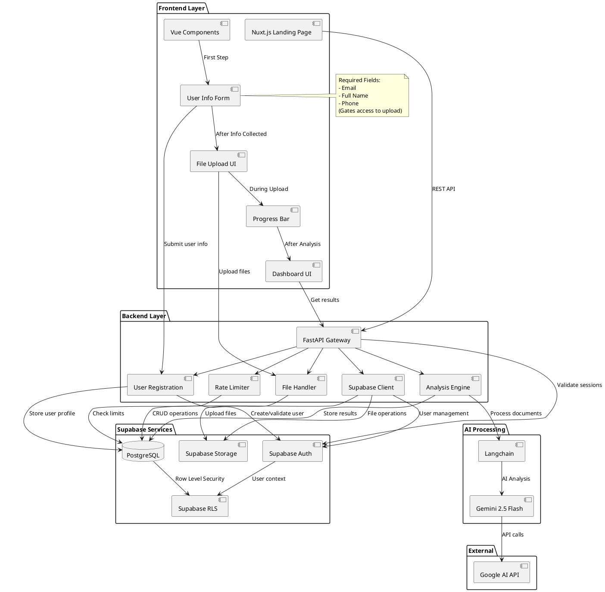
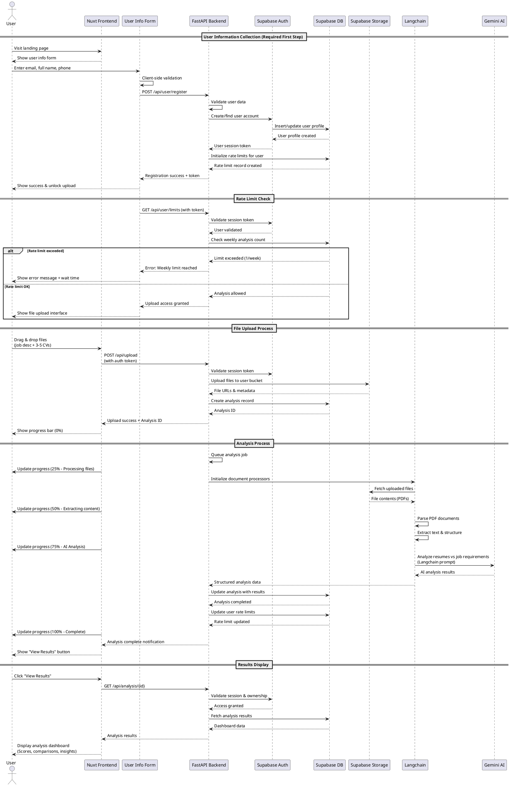

# NoaMetrics CV Analysis Component - Architecture

## Overview
AI-powered resume analysis component that processes job requirements and candidate CVs to provide intelligent matching and insights. 
**Users must provide contact information (email, full name, phone) before accessing analysis features.**

## Architecture Components

### Frontend (Nuxt.js)
```
┌─────────────────────────────────────┐
│           Landing Page              │
├─────────────────────────────────────┤
│ • Hero Section                      │
│ • User Info Form (REQUIRED FIRST)   │
│ • File Upload Component             │
│ • Progress Indicator                │
│ • Analysis Dashboard                │
└─────────────────────────────────────┘
```

### Backend (FastAPI/Python)
```
┌─────────────────────────────────────┐
│           API Gateway               │
├─────────────────────────────────────┤
│ • User Registration Service         │
│ • File Upload Handler               │
│ • Rate Limiting Service             │
│ • Analysis Engine                   │
│ • Supabase Integration              │
└─────────────────────────────────────┘
```

## Data Flow

### 1. User Registration (Required First Step)
- **Input**: Email, Full Name, Phone (mandatory)
- **Validation**: Email format, phone format, name requirements
- **Output**: User session token + rate limit check
- **Gate**: Unlocks file upload interface

### 2. Rate Limit Validation
- **Check**: 1 analysis per user per week (configurable)
- **Enforcement**: Block upload if limit exceeded
- **Display**: Time remaining until next analysis allowed

### 3. File Processing (After Registration)
```
User Info → Session Token → Rate Check → Upload → Analysis Queue
```

### 4. AI Analysis Pipeline
```
Files → Langchain → Gemini 2.5 Flash → Results → Dashboard
```

## Core Services

### User Registration Service
- **Form**: Email, full name, phone validation
- **Storage**: Supabase Auth + profiles table
- **Session**: JWT token generation
- **Access Control**: Gate to unlock upload interface
- **Rate Limits**: Initialize weekly analysis counter

### File Upload Service
- **Prerequisites**: Valid user session required
- **Drag & Drop**: Vue.js dropzone component
- **Browser Modal**: Native file picker fallback
- **Progress**: Real-time upload tracking
- **Storage**: Supabase Storage buckets
- **Validation**: PDF format, size limits

### Analysis Service
- **Trigger**: After successful file upload
- **Parser**: Langchain document loaders
- **AI Engine**: Gemini 2.5 Flash integration
- **Processing**: Resume extraction & job matching
- **Output**: Structured candidate insights

### Dashboard Service
- **Access Control**: User can only view own analyses
- **Data Source**: Supabase realtime subscriptions
- **Visualization**: Candidate comparison tables
- **Metrics**: Scores, skills, experience matching

### Rate Limiting Service
- **Enforcement**: Check before allowing upload
- **Storage**: Supabase PostgreSQL table
- **Logic**: 1 analysis per user per week (configurable)
- **Reset**: Weekly reset mechanism
- **Feedback**: Clear messaging when limit reached

## API Endpoints

```
POST /api/user/register   # User registration (email, name, phone)
GET  /api/user/limits     # Check rate limits
POST /api/upload          # File upload (requires valid session)
POST /api/analyze         # Trigger analysis
GET  /api/analysis/{id}   # Get analysis results
```

## Updated User Flow
```
Landing Page → User Info Form → Rate Limit Check → File Upload → Progress → Results
     ↓              ↓                ↓               ↓           ↓         ↓
   Hero          Required         Block if        Drag &      Real-    Dashboard
  Section        Fields           Exceeded        Drop        time      Display
```

## Supabase Schema (Updated)

### Tables
```sql
-- Auth handled by Supabase Auth
profiles (
  id uuid references auth.users primary key,
  email text unique not null,
  full_name text not null,
  phone text not null,
  created_at timestamp default now(),
  updated_at timestamp default now()
);

analyses (
  id uuid primary key default gen_random_uuid(),
  user_id uuid references profiles(id) not null,
  job_description text not null,
  status text default 'pending', -- pending, processing, completed, failed
  results jsonb,
  created_at timestamp default now()
);

uploaded_files (
  id uuid primary key default gen_random_uuid(),
  analysis_id uuid references analyses(id) not null,
  filename text not null,
  file_path text not null, -- Supabase Storage path
  file_type text not null,
  file_size integer,
  created_at timestamp default now()
);

rate_limits (
  user_id uuid references profiles(id) primary key,
  analysis_count integer default 0,
  last_analysis timestamp,
  week_start timestamp default date_trunc('week', now()),
  max_weekly_analyses integer default 1, -- configurable
  updated_at timestamp default now()
);
```

### Storage Buckets
```
cv-uploads/
├── {user_id}/
│   ├── {analysis_id}/
│   │   ├── job-description.pdf
│   │   ├── resume-1.pdf
│   │   ├── resume-2.pdf
│   │   └── ...
```

### Row Level Security (RLS)
```sql
-- Enhanced RLS with user info requirements
ALTER TABLE profiles ENABLE ROW LEVEL SECURITY;
ALTER TABLE analyses ENABLE ROW LEVEL SECURITY;
ALTER TABLE uploaded_files ENABLE ROW LEVEL SECURITY;
ALTER TABLE rate_limits ENABLE ROW LEVEL SECURITY;

-- RLS Policies
CREATE POLICY "Users can view own profile" ON profiles
  FOR SELECT USING (auth.uid() = id);

CREATE POLICY "Users can view own analyses" ON analyses
  FOR SELECT USING (auth.uid() = user_id);

CREATE POLICY "Users can view own rate limits" ON rate_limits
  FOR SELECT USING (auth.uid() = user_id);
```

## Form Validation Rules

### Client-Side (Vue.js)
```javascript
{
  email: [
    { required: true, message: 'Email is required' },
    { type: 'email', message: 'Invalid email format' }
  ],
  full_name: [
    { required: true, message: 'Full name is required' },
    { min: 2, message: 'Name must be at least 2 characters' }
  ],
  phone: [
    { required: true, message: 'Phone number is required' },
    { pattern: /^[\+]?[1-9][\d]{0,15}$/, message: 'Invalid phone format' }
  ]
}
```

### Server-Side (FastAPI)
```python
from pydantic import BaseModel, EmailStr, validator

class UserRegistration(BaseModel):
    email: EmailStr
    full_name: str
    phone: str
    
    @validator('full_name')
    def validate_name(cls, v):
        if len(v.strip()) < 2:
            raise ValueError('Name too short')
        return v.strip()
    
    @validator('phone')
    def validate_phone(cls, v):
        # Phone validation logic
        return v
```

## Security & Performance
- **Gated Access**: User info required before any file operations
- **Authentication**: Supabase Auth with JWT tokens
- **File Security**: Supabase Storage with RLS
- **Rate Limiting**: Database-enforced weekly limits
- **Data Retention**: Auto-delete analyses after 30 days
- **Form Security**: CSRF protection, input sanitization
- **Privacy**: Clear data usage disclosure

## Environment Variables
```env
SUPABASE_URL=your-project-url
SUPABASE_ANON_KEY=your-anon-key
SUPABASE_SERVICE_ROLE_KEY=your-service-role-key
GEMINI_API_KEY=your-gemini-key
MAX_WEEKLY_ANALYSES=1  # Configurable rate limit
MAX_FILE_SIZE=10MB     # Per file limit
MAX_FILES_PER_ANALYSIS=6  # Job desc + 5 CVs
```

## Deployment Considerations
- **Frontend**: Nuxt.js with form validation
- **Backend**: FastAPI with Pydantic validation
- **Database**: Supabase PostgreSQL with constraints
- **Storage**: Supabase Storage with access policies
- **Auth**: Supabase Auth with profile completion check
- **Monitoring**: Track user registration conversion rates

## NoaMetrics CV Analysis - PlantUML Diagrams

### 1. Component Schema



### 2. Sequence Diagram



### Additional Technical Notes

#### Component Relationships
- **Frontend** communicates with **Backend** via REST API
- **Backend** integrates with **Supabase** for all data operations
- **AI Processing** is triggered by backend and processes files from storage
- **Authentication** flows through Supabase Auth with JWT tokens

#### Critical User Info Form
- Gating Mechanism: Users MUST provide email, full name, and phone before accessing file upload
- Form Validation: Both client-side and server-side validation
- Session Creation: User info creates authenticated session for subsequent operations
- Rate Limit Initialization: User registration sets up weekly analysis limits

#### Updated Flow
- User Info Collection (Required first step)
- Rate Limit Check (Before allowing upload)
- File Upload (Only after user info collected)
- Analysis Processing (With progress updates)
- Results Display (With ownership validation)